# Stock assets

Every BUSY Bar ships with pictures, animations, sounds, fonts and themes
already on it. Referencing one costs nothing and needs no upload - which makes
it the first thing to reach for, before [converting and uploading your
own](assets-and-storage.md).

Everything here is shown as well as named: the pictures and animations are
enlarged onto the black an unlit panel shows, and the sounds have players. One
thing does not survive being read on GitHub - it drops audio players - so the
[published guide](https://busy-app.github.io/busylib-py/guides/stock-assets/) is
the complete version.

They live under `/ext/apps_assets/`, in two trees:

| Tree | What it is |
| --- | --- |
| `shared/` | For anyone: icons, status animations, fonts, notification sounds |
| `busy/` | The BUSY timer's own decoration - session animations, indicators, its themes |

## How to reference one

Anything that draws or plays takes **`stock_path`** for a built-in and `path`
for a file you uploaded. A stock path is the tree, the folder and the file
name with its extension - relative to `/ext/apps_assets/`:

```python
from busylib import BusyBar, types

with BusyBar("192.168.1.50", token=PIN) as bar:
    bar.display_draw(
        types.DisplayElements(
            application_name="my-app",
            elements=[
                types.ImageElement(
                    id="10",
                    x=0,
                    y=4,
                    stock_path="shared/images/clock_5x5.image",
                ),
            ],
        )
    )

    bar.audio_play(
        stock_path="shared/sounds/calendar_event_starts.snd",
        application_name="my-app",
    )
```

The folder and the extension are both required: the flat `shared/clock` form
the OpenAPI spec suggests is refused by the device.

The size is in the file name, and it is the size you have to lay out around -
`clock_5x5.image` is five pixels square. `_front_` and `_back_` say which
display an asset was drawn for: the front is a 72x16 strip, the back a 16x16
square. Nothing stops you drawing either one anywhere; it will just look wrong.

## What is there

The counts below come from the firmware sources, not from a bar: a bar
carries whatever its owner has uploaded or deleted, and a bar on an older
build has whatever that build shipped - as this one does, with 19 of the 20
status animations, because the twentieth landed a week after it was built. So
this is what a bar ships with, and [asking a bar](#reading-the-map-from-a-bar)
is how you find out what one actually has.

`make stock-assets FIRMWARE=<checkout>` regenerates the table, and `CHECK=1`
reports drift without writing:

<!-- begin stock assets map -->
Counted from the firmware sources at `736af4c78, 2026-09-11`:

| | On the device | How many | Since | Last changed |
| --- | --- | --- | --- | --- |
| Icons and pictures | `shared/images/` | 84, 66 of them the `dt_*` sticker set | 0.8.1 | 2026-08-07 |
| Status animations | `shared/animations/` | 20 | 0.8.1 | 2026-09-11 |
| Fonts | `shared/fonts/` | 10 | 0.8.1 | 2026-05-15 |
| Notification sounds | `shared/sounds/` | 3 | 0.8.1 | 2026-05-12 |
| Timer animations | `busy/animations/` | 22 | 0.1.0 | 2026-07-16 |
| Timer pictures | `busy/images/` | 13 | 0.1.0 | 2026-07-16 |
| Timer sounds | `busy/sounds/` | 3 | 0.1.0 | 2026-03-20 |
| Themes | `busy/themes/` | 12 | 0.7.2 | 2026-05-13 |
<!-- end stock assets map -->

### Icons

Eight of them have names in `busylib`, because [notifications](notifications.md)
lay themselves out around one and need its width. The pictures below link into
the firmware at the commit the table above was counted from, so they cannot
drift from it:

<!-- begin stock assets gallery -->
The eight with short names:

| | Name | File |
| --- | --- | --- |
| 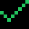 | `check` | `checkmark_front_8x8.image` |
|  | `error` | `error_front_8x8.image` |
|  | `info` | `info_front_8x8.image` |
| 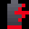 | `low_battery` | `low_battery_front_8x8.image` |
| 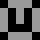 | `clock` | `clock_5x5.image` |
| 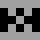 | `hourglass` | `hourglass_5x5.image` |
|  | `start` | `start_11x11.image` |
|  | `setup` | `setup_11x11.image` |

The Draw Tool's set, under the names the Draw Tool shows - these are 16x16, twice the width of most built-in icons, and the layout moves the text along accordingly:

| | | | | | |
| --- | --- | --- | --- | --- | --- |
| 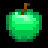<br>`dt_apple_green` | <br>`dt_apple_red` | 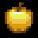<br>`dt_apple_yellow` | <br>`dt_available` | 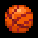<br>`dt_basketball` | 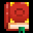<br>`dt_book` |
| 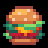<br>`dt_burger` | 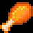<br>`dt_chicken` | <br>`dt_coctail` | 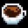<br>`dt_coffee` | 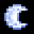<br>`dt_crescent_moon_1` | 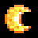<br>`dt_crescent_moon_2` |
| <br>`dt_dialog` | <br>`dt_dialog_no` | <br>`dt_dialog_yes` | <br>`dt_drink_1` | 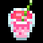<br>`dt_drink_2` | 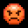<br>`dt_emoji_angry` |
| <br>`dt_emoji_awkward` | <br>`dt_emoji_cry` | <br>`dt_emoji_dead` | 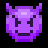<br>`dt_emoji_evil` | <br>`dt_emoji_expressionless` | 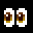<br>`dt_emoji_eyes` |
| <br>`dt_emoji_fatigue` | <br>`dt_emoji_glasses` | <br>`dt_emoji_grinning` | <br>`dt_emoji_happy` | <br>`dt_emoji_heart_eyes` | <br>`dt_emoji_laught` |
| <br>`dt_emoji_melted` | 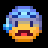<br>`dt_emoji_panic` | 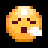<br>`dt_emoji_relief` | <br>`dt_emoji_sad` | <br>`dt_emoji_sleep` | 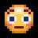<br>`dt_emoji_surprised` |
| <br>`dt_emoji_sweat_smile` | 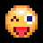<br>`dt_emoji_tounge` | <br>`dt_football` | <br>`dt_heart_blue` | <br>`dt_heart_green` | <br>`dt_heart_light_blue` |
| <br>`dt_heart_orange` | <br>`dt_heart_pink` | <br>`dt_heart_red` | <br>`dt_heart_violet` | <br>`dt_heart_yellow` | 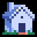<br>`dt_home` |
| 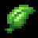<br>`dt_leaf` | <br>`dt_moon_1` | 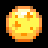<br>`dt_moon_2` | 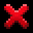<br>`dt_no` | 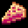<br>`dt_pie` | <br>`dt_pizza` |
| <br>`dt_pizza_margarita` | <br>`dt_pizza_peperoni` | 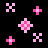<br>`dt_sparkls_1` | 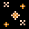<br>`dt_sparkls_2` | 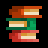<br>`dt_study` | <br>`dt_tea` |
| <br>`dt_tennis` | 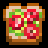<br>`dt_toast` | 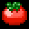<br>`dt_tomato` | 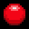<br>`dt_unavailable` | 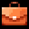<br>`dt_work` | <br>`dt_yes` |

The rest of what the firmware ships, mostly its own furniture:

| | | | | | |
| --- | --- | --- | --- | --- | --- |
| <br>`active_indicator_left_28x7` | <br>`active_indicator_right_28x7` | 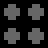<br>`apps_menu_back_12x12` | 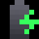<br>`charging_battery_front_8x8` | 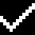<br>`checkmark_back_11x11` | <br>`error_back_11x11` |
| <br>`info_back_11x11` | <br>`missing_battery_front_8x8` | <br>`unknown_app_back_11x11` | <br>`unknown_app_front_8x8` |

And the timer's own:

| | | | | | |
| --- | --- | --- | --- | --- | --- |
| <br>`header_busy_41x16` | <br>`header_custom_41x16` | 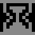<br>`hourglass_11x11` | 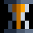<br>`hourglass_8x8` | <br>`indicator_busy_41x16` | <br>`indicator_mask_41x16` |
| <br>`indicator_rest_41x16` | 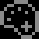<br>`palette_11x11` | 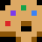<br>`palette_8x8` | 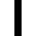<br>`pause_5x5` | <br>`smart_home_11x11` | 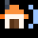<br>`smart_home_8x8` |
| 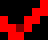<br>`tick_red_6x5` |
<!-- end stock assets gallery -->

The names in code:

| Name | File | Width |
| --- | --- | --- |
| `check` | `shared/images/checkmark_front_8x8.image` | 8 |
| `error` | `shared/images/error_front_8x8.image` | 8 |
| `info` | `shared/images/info_front_8x8.image` | 8 |
| `low_battery` | `shared/images/low_battery_front_8x8.image` | 8 |
| `clock` | `shared/images/clock_5x5.image` | 5 |
| `hourglass` | `shared/images/hourglass_5x5.image` | 5 |
| `start` | `shared/images/start_11x11.image` | 11 |
| `setup` | `shared/images/setup_11x11.image` | 11 |

```python
from busylib.features import notification

await notification.notify(bar, "Laundry done", icon="check", application_name="my-app")
```

`notification.icons(bar)` returns every image the bar actually holds, each with
the width read from its file header - the `dt_*` sticker set included (food,
faces, activities: `dt_coffee`, `dt_emoji_happy`, `dt_work` ...). Pass a
`StockIcon` from that list anywhere a name is taken.

### Animations

`shared/animations/` holds the twelve status animations, one per theme, as
72x16 strips - `dnd_72x16.anim`, `meeting_72x16.anim`, `lunch_72x16.anim`,
`flow_72x16.anim`, `coding_72x16.anim`, `on_air_72x16.anim`,
`on_call_72x16.anim`, `booked_72x16.anim`, `back_soon_72x16.anim`,
`chill_time_72x16.anim`, `keep_out_72x16.anim`,
`low_social_battery_72x16.anim` - plus the calendar, spinner and transition
pieces the firmware uses.

`busy/animations/` is the timer's own: progress, particles, the start logos and
the transitions between phases.

These are the only pictures kept here rather than linked: the source is a zip
of frames, which no browser unpacks. They are thinned to about two dozen frames
with the delay stretched to match, so the movement is the bar's at a fraction
of the weight.

<!-- begin stock animations gallery -->
What the firmware ships:

| | | |
| --- | --- | --- |
| 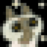<br>`azuki_16x16`<br><small>8 of 8 frames</small> | <br>`back_soon_72x16`<br><small>17 of 241 frames</small> | <br>`booked_72x16`<br><small>16 of 600 frames</small> |
| <br>`calendar_event_16x16`<br><small>17 of 180 frames</small> | <br>`calendar_reminder_16x16`<br><small>17 of 180 frames</small> | <br>`chill_time_72x16`<br><small>16 of 600 frames</small> |
| <br>`coding_72x16`<br><small>17 of 296 frames</small> | <br>`dnd_72x16`<br><small>16 of 77 frames</small> | <br>`flow_72x16`<br><small>16 of 301 frames</small> |
| 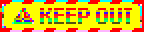<br>`keep_out_72x16`<br><small>17 of 181 frames</small> | 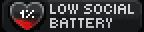<br>`low_social_battery_72x16`<br><small>16 of 300 frames</small> | <br>`lunch_72x16`<br><small>16 of 540 frames</small> |
| <br>`meeting_72x16`<br><small>16 of 525 frames</small> | 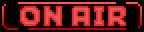<br>`on_air_72x16`<br><small>17 of 181 frames</small> | <br>`on_call_72x16`<br><small>16 of 121 frames</small> |
| 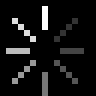<br>`spinner_back_16x16`<br><small>8 of 8 frames</small> | 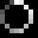<br>`spinner_front_8x8`<br><small>16 of 16 frames</small> | 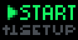<br>`start_menu_31x16`<br><small>17 of 260 frames</small> |
| <br>`transition_select_72x16`<br><small>17 of 66 frames</small> | <br>`wave_invitation_72x16`<br><small>19 of 55 frames</small> |

The timer's own:

| | | |
| --- | --- | --- |
| <br>`arrow_green_5x5`<br><small>15 of 60 frames</small> | <br>`arrow_red_5x5`<br><small>15 of 60 frames</small> | <br>`ending_particles_72x16`<br><small>16 of 121 frames</small> |
| <br>`ending_progress_72x16`<br><small>16 of 106 frames</small> | <br>`finished_confetti_72x16`<br><small>17 of 181 frames</small> | <br>`indicator_busy_72x16`<br><small>16 of 1200 frames</small> |
| <br>`indicator_busy_transition_72x16`<br><small>14 of 41 frames</small> | <br>`overview_72x16`<br><small>17 of 135 frames</small> | <br>`particles_busy_41x16`<br><small>15 of 60 frames</small> |
| <br>`particles_rest_41x16`<br><small>15 of 60 frames</small> | <br>`progress_busy_41x16`<br><small>1 of 1 frames</small> | <br>`progress_rest_41x22`<br><small>17 of 150 frames</small> |
| <br>`start_logo_busy_41x16`<br><small>15 of 120 frames</small> | <br>`start_logo_custom_41x16`<br><small>15 of 120 frames</small> | <br>`transition_done_busy_72x16`<br><small>16 of 31 frames</small> |
| <br>`transition_done_rest_72x16`<br><small>16 of 31 frames</small> | <br>`transition_flash_72x16`<br><small>21 of 21 frames</small> | <br>`transition_oval_72x16`<br><small>14 of 41 frames</small> |
| <br>`transition_pause_72x16`<br><small>14 of 41 frames</small> | <br>`transition_select_green_72x16`<br><small>17 of 66 frames</small> | <br>`transition_select_red_72x16`<br><small>17 of 66 frames</small> |
| <br>`transition_skip_72x16`<br><small>15 of 30 frames</small> |
<!-- end stock animations gallery -->

```python
types.AnimationElement(
    id="10",
    x=0,
    y=0,
    loop=True,
    stock_path="shared/animations/dnd_72x16.anim",
)  # one element of a DisplayElements payload, as above
```

### Sounds

| Stock path | When the firmware uses it |
| --- | --- |
| `shared/sounds/calendar_event_starts.snd` | An event is starting |
| `shared/sounds/calendar_reminder_ends.snd` | A reminder is over |
| `shared/sounds/volume_change.snd` | The volume moved |
| `busy/sounds/countdown_tick.snd` | A session's last seconds |
| `busy/sounds/countdown_finish.snd` | A phase ended |
| `busy/sounds/session_completed.snd` | The whole session ended |

The first three have short names in `notification.STOCK_SOUNDS` (`event`,
`reminder`, `volume`) and are what `notify(sound=...)` takes. The players below
point at the firmware's own WAV sources, so this is what a bar actually plays -
**on GitHub they are not shown**, since it drops audio players from a rendered
file; the [published guide](https://busy-app.github.io/busylib-py/guides/stock-assets/)
has them.

<!-- begin stock sounds gallery -->
| | Sound | Used for |
| --- | --- | --- |
| <audio controls preload="none" style="height:32px" src="https://raw.githubusercontent.com/busy-app/busybar-firmware/736af4c78f0450e108b55526716174300ddc2f8c/assets/shared/sounds/calendar_event_starts.wav"></audio> | `calendar_event_starts` | an event is starting |
| <audio controls preload="none" style="height:32px" src="https://raw.githubusercontent.com/busy-app/busybar-firmware/736af4c78f0450e108b55526716174300ddc2f8c/assets/shared/sounds/calendar_reminder_ends.wav"></audio> | `calendar_reminder_ends` | a reminder is over |
| <audio controls preload="none" style="height:32px" src="https://raw.githubusercontent.com/busy-app/busybar-firmware/736af4c78f0450e108b55526716174300ddc2f8c/assets/shared/sounds/volume_change.wav"></audio> | `volume_change` | the volume moved |
| <audio controls preload="none" style="height:32px" src="https://raw.githubusercontent.com/busy-app/busybar-firmware/736af4c78f0450e108b55526716174300ddc2f8c/assets/sounds/busy/countdown_finish.wav"></audio> | `countdown_finish` | a phase ended |
| <audio controls preload="none" style="height:32px" src="https://raw.githubusercontent.com/busy-app/busybar-firmware/736af4c78f0450e108b55526716174300ddc2f8c/assets/sounds/busy/countdown_tick.wav"></audio> | `countdown_tick` | a session's last seconds |
| <audio controls preload="none" style="height:32px" src="https://raw.githubusercontent.com/busy-app/busybar-firmware/736af4c78f0450e108b55526716174300ddc2f8c/assets/sounds/busy/session_completed.wav"></audio> | `session_completed` | the whole session ended |
<!-- end stock sounds gallery -->

### Fonts

Text names a font rather than pointing at one: `tiny`, `small`, `normal`,
`condensed`, `bold`, `large`, `extra_large`, and `superscript` - which the
firmware added in OpenAPI 27.6 for the raised digits a countdown draws. The
largest do not fit two lines on the front display, which is why
`notification.TWO_LINE_FONTS` is the shorter list.

### Themes

`busy/themes/<name>/theme.json` - twelve of them, and they are what a session
looks like on the bar. They are chosen by name, not by path:

```python
from busylib.features import timer

await timer.themes(bar)  # what this bar has
await timer.start(bar, theme="meeting")  # for this session only
await timer.set_card_theme(bar, "busy", "dnd")  # from now on
```

A theme a bar does not have raises `UnknownThemeError` rather than being
written and silently ignored. See [timers](timers.md).

## Your own assets

An application can upload its own, and they are drawn and played the same way
- with one difference worth knowing. Uploads live in
`/ext/user_assets/<application>/`, and the device resolves a `path` inside the
folder of the application making the call. So an upload is named by file name
alone, the same name in two applications is two different files, and one
application cannot draw another's:

```python
from busylib import converter
from busylib.features import notification

name, payload = converter.convert_for_storage("logo.png", open("logo.png", "rb").read())
await bar.assets_upload(application_name="my-app", filename=name, data=payload)

await notification.notify(bar, "Deploy done", icon="logo", application_name="my-app")
```

The size comes from the file - a PNG's IHDR, or the firmware format's own
header - because an icon's width is what the text is placed after, and an icon
wider than the panel pushes the text off the display. One that does not fit is
refused rather than drawn.

## Reading the map from a bar

Firmware adds and removes assets, and an owner can upload their own, so the
bar is the only authority:

```python
from busylib.features import assets

for asset in await assets.discover_assets(bar):
    print(asset.kind, asset.name, asset.reference, asset.application)
```

`discover_assets` reads both roots and every kind - images, animations,
sounds, fonts and themes - and gives back what to pass in a call:
`stock_path` for a shipped asset, `path` for an upload. `assets.of_kind(bar,
"image")` is the same thing as the name-to-path mapping a picker wants, and
`notification.icons(bar)` and `timer.themes(bar)` are the two shorthands for
the lists most often offered to a person. None of them has a copy written down
in the library to go stale.
